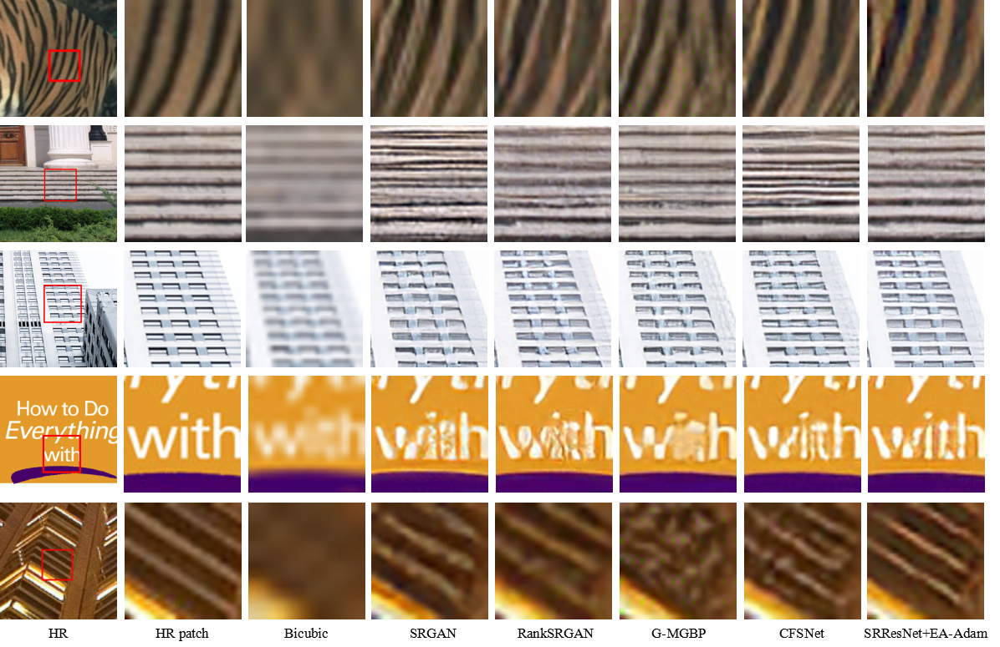

      
## Perception-Distortion Balanced Super-Resolution: A Multi-Objective Optimization Perspective


<a href='https://arxiv.org/abs/2312.15408'></a>

[Lingchen Sun](https://scholar.google.com/citations?hl=zh-CN&tzom=-480&user=ZCDjTn8AAAAJ)<sup>1,2</sup>
| [Jie Liang](https://scholar.google.com/citations?hl=zh-CN&user=REWxLZsAAAAJ)<sup>2</sup> | 
[Shuaizheng Liu](https://scholar.google.com/citations?hl=zh-CN&user=wzdCc-QAAAAJ)<sup>1,2</sup> | 
[Hongwei Yong](https://scholar.google.com.hk/citations?user=Xii74qQAAAAJ&hl=zh-CN)<sup>1</sup> | 
[Lei Zhang](https://www4.comp.polyu.edu.hk/~cslzhang)<sup>1,2</sup>

<sup>1</sup>The Hong Kong Polytechnic University, <sup>2</sup>OPPO Research Institute

:star: If EA-Adam is helpful to your images or projects, please help star this repo. Thanks! :hugs:

## 🌟 Overview framework


## 🌟 Visual Results
### <summary>SRResNet Backbone (click to expand)</summary>
<p align="center">

</p>

### <summary>RRDB Backbone (click to expand)</summary>
<p align="center">

</p>

### <summary>SwinIR Backbone (click to expand)</summary>
<p align="center">

</p>

For more comparisons, please refer to our paper for details.

## ⚙ Dependencies and Installation
```shell
## git clone this repository
git clone https://github.com/csslc/EA-Adam.git
cd EA-Adam

# create an environment with python >= 3.7
conda create -n EA-Adam python=3.7
conda activate EA-Adam
pip install -r requirements.txt
```

## 🍭 Quick Inference
#### Step 1: Download the pretrained models
| Model Name                | Description                               | GoogleDrive                                                                                       | BaiduNetdisk                                                         |
|:--------------------------|:------------------------------------------|:--------------------------------------------------------------------------------------------------|:---------------------------------------------------------------------|
| EA-Adam-srresnet.ckpt     | EA-Adam model with the SRResNet backbone. | download | downloadhttps://pan.baidu.com/s/1uYi0-8nyH35P5rMsLD1J0w              |
| EA-Adam-rrdb.ckpt         | EA-Adam model with the rrdb backbone.     | download                                                                                          | download                                                             |
| EA-Adam-swinir-light.ckpt | EA-Adam model with the swinir_L backbone. | download                                                                                          | download                                                             |

#### Step 2: Prepare testing data
You can put the testing images in the `test_input`.

#### Step 3: Running testing command
```
python test.py \
--input_image test_input \
--config configs/mulsrresnet_gan.yml \
--test_model_path weights/EA-Adam-srresnet.ckpt \
--root_img output
```

## 🍭 Train

### License
This project is released under the [Apache 2.0 license](LICENSE).

### Acknowledgement

### Citations
If our code helps your research or work, please consider citing our paper.
The following are BibTeX references:

```
@article{sun2024eaadam,
  title={Perception-Distortion Balanced Super-Resolution: A Multi-Objective Optimization Perspective},
  author={Sun, Lingchen and Liang, Jie and Liu, Shuaizheng and Yong, Hongwei and Zhang, Lei},
  journal={IEEE Transactions on Image Processing},
  year={2024}
}
```

### Contact
If you have any questions, please feel free to contact: ling-chen.sun@connect.polyu.hk


<details>
<summary>statistics</summary>


</details>


